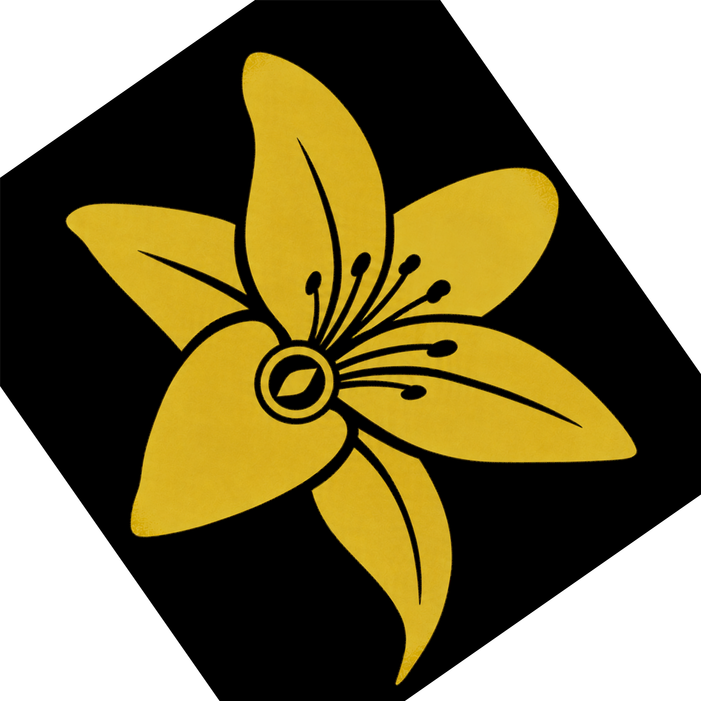

  

 

 

  
  
  

---

## About Me

- Systems Analysis and Development student at UNOESTE
- Backend-focused developer with experience building REST APIs and fullstack applications
- Strong foundation in programming logic, data structures and C programming
- Currently working with React, TypeScript, Laravel, PostgreSQL and MySQL
- Interested in backend architecture, database modeling, RPG tools and creative software projects

---

## Current Focus

- Building **Maiden-Gate**, a fullstack web platform for my original tabletop RPG universe
- Improving backend architecture with Laravel, Node.js and REST APIs
- Working with PostgreSQL, MySQL, authentication, data modeling and API integration
- Developing practical portfolio projects with real rules, persistence and user flows
- Studying fullstack development to expand my professional opportunities

---

## Maiden-Gate

  

 

**Maiden-Gate** is a fullstack web platform designed to support sessions of my original tabletop RPG universe, **Voice of Flower: Awakening of the Maiden**.

The application includes authentication, role-based dashboards for Game Masters and Players, campaign management, character creation, inventory control, shared dice rolls, session scheduling, image uploads and RPG data structures connected to a Laravel API and PostgreSQL database.

 

  
  

  
  

 

 

### Project Highlights

- Fullstack architecture with separated frontend and backend
- Laravel API connected to a PostgreSQL database
- React + TypeScript frontend focused on RPG session management
- Authentication with role-based access for Game Masters and Players
- Data modeling for users, campaigns, characters, marks, skills, inventory, NPCs and bestiary
- Shared dice roll chat between Game Masters and Players
- Functional character creation, campaign management and inventory system
- Original visual identity inspired by **Voice of Flower**

---

## Tech Stack

---

## Other Featured Projects

### Product Management API

REST API with full CRUD operations, data validation, and MySQL integration.

[Repository](https://github.com/malvino11-28/api-gerenciamento-produto)

  ────────────────────────────── ✦ ──────────────────────────────

### Personal Portfolio

React application with responsive design, animations, and a functional contact form.

[Repository](https://github.com/malvino11-28/portfolio-malvino) | [Deploy](https://portfolio-malvino.vercel.app)

  ────────────────────────────── ✦ ──────────────────────────────

### Commercial Management System in C

Academic project developed in C, focused on file handling, CRUD operations, sorting, validation, reports and structured programming.

[Repository](https://github.com/malvino11-28/c-algoritmos-e-estruturas)

---

## Contact

  
  &nbsp;&nbsp;&nbsp;&nbsp;
  

